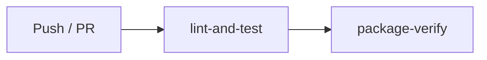

# CI 测试工作流

## 触发条件

每次 push 到 `main`/`master` 分支以及任何 PR 都会触发。

## 工作流文件

`.github/workflows/test.yml`

## 任务结构



### 1. lint-and-test（双平台）

在 **Ubuntu** 和 **macOS** 上并行运行：

| 步骤 | 检查项 |
|------|--------|
| ShellCheck | 对 `bin/sshm.sh`、`scripts/*.sh`、`lib/*.sh` 做静态分析 |
| Bats 测试 | 运行 `tests/` 下的全部单元测试（当前 73+ 个） |
| Syntax check | `bash -n` 验证所有 shell 脚本语法 |
| 版本一致性 | 检查 `VERSION` 文件与 `bin/sshm.sh` 中嵌入的版本号是否一致 |

### 2. package-verify（五种包格式）

依赖 `lint-and-test` 通过后，在 Ubuntu 上逐一验证每种包格式的安装→运行→卸载循环：

| 格式 | 构建命令 | 验证流程 |
|------|----------|----------|
| `.deb` | `scripts/package.sh` | `dpkg -i` → `sshm --version` `--help` `--validate` → `dpkg -r` |
| `.rpm` | `scripts/package.sh`（Fedora Docker） | `rpm -ivh` → 同上 → `rpm -e` |
| `.run` | `scripts/build_makeself.sh` | 运行自解压包 → 同上 → `sshm-uninstall` |
| `.tar.gz` | `scripts/package.sh` | 解压 → `./install.sh` → 同上 → uninstall |
| Arch | `makepkg`（Arch Docker） | `pacman -U` → 同上 → `pacman -R` |

每种格式的验证步骤：

```bash
sshm --version          # 版本号正常输出
sshm --help             # 帮助信息正常
sshm --config /tmp/test-config.yaml --validate  # 配置校验
# 检查 shell 补全已部署到系统路径
test -f /usr/share/bash-completion/completions/sshm  # bash
test -f /usr/share/zsh/site-functions/_sshm          # zsh
```

## 失败排查

| 失败表现 | 常见原因 | 排查方向 |
|----------|----------|----------|
| ShellCheck 报错 | shell 脚本不符合 SC 规范 | 查看 SC 编号，修改变量引用方式 |
| Bats 测试失败 | 功能回归 | 运行 `bats tests/` 本地重现 |
| package-verify 失败 | 打包脚本问题 | 本地运行对应 `scripts/` 脚本 |
| Arch build 失败 | Docker 镜像缓存 | 在 `actions/checkout` 后加 `docker pull archlinux:latest` |
