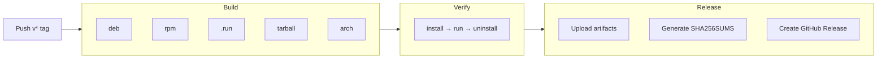

# 发布流程

## 版本号规范

遵循 [SemVer](https://semver.org/)（语义化版本）：`主版本.次版本.修订号`

- 修订号（Z）：向后兼容的 bug 修复
- 次版本（Y）：向后兼容的新功能
- 主版本（X）：不兼容的 API 变更

当前版本：`0.5.x`（初始开发阶段，次版本可含不兼容变更）

## 发布步骤

### 1. 更新 CHANGELOG

将 `## [Unreleased]` 下的变更整理成可读的发布说明：

```markdown
## [Unreleased]

### Added
- 新功能 A
- 新功能 B

### Fixed
- 修复问题 C
```

确保 `[Unreleased]` 中记录了当前迭代的所有变更。格式参考 [Keep a Changelog](https://keepachangelog.com/)。

> 后续步骤由 `scripts/tag.sh` 自动完成，只需确认 CHANGELOG 内容已更新即可。

### 2. 执行发布脚本

```bash
# 交互式（提示输入版本号）
./scripts/tag.sh

# 或直接指定版本号（非交互，适合 CI）
./scripts/tag.sh 0.6.0
```

脚本自动完成：

| # | 操作 | 文件 |
|---|------|------|
| 1 | 写入新版本 | `VERSION` |
| 2 | 替换版本号 | `README.md`（badge + 下载链接） |
| 3 | 插入版本节 | `CHANGELOG.md`（在 `[Unreleased]` 后插入 `[X.Y.Z]`） |
| 4 | 提交 + 打 tag | `git commit` + `git tag vX.Y.Z` |

### 3. 推送 tag 触发 CI Release

```bash
git push --follow-tags
```

## CI 自动发布流程

推送 `v*` tag 到 GitHub 后，[release.yml](../.github/workflows/release.yml) 自动执行：



1. **Build** — 并行构建 5 种包格式（deb/rpm/run/tarball/arch）
2. **Verify** — 逐一验证安装→运行`--version --help --validate`→卸载
3. **Release** — 上传构建产物、生成 SHA256 校验和、创建 GitHub Release

发布产物自动包含在 Release 页面中：

- `ssh-manager-{version}.run`（自解压安装包）
- `ssh-manager_{version}-1_all.deb`
- `ssh-manager-{version}-1.noarch.rpm`
- `ssh-manager-{version}-4-any.pkg.tar.zst`
- `ssh-manager-{version}.tar.gz`
- `SHA256SUMS`（所有文件的校验和）

## 手动触发

在 GitHub Actions 页面选择 `Release` workflow，点击 **Run workflow**，可从任意分支手动构建并测试包格式，但不会更新 README/VERSION 或创建 Release。

## 快速参考

```bash
# 完整发布流程
vim CHANGELOG.md              # 整理变更日志
./scripts/tag.sh 0.6.0        # 必选：版本号不可与当前相同
git push --follow-tags        # 触发 CI 构建 + 发布
```
